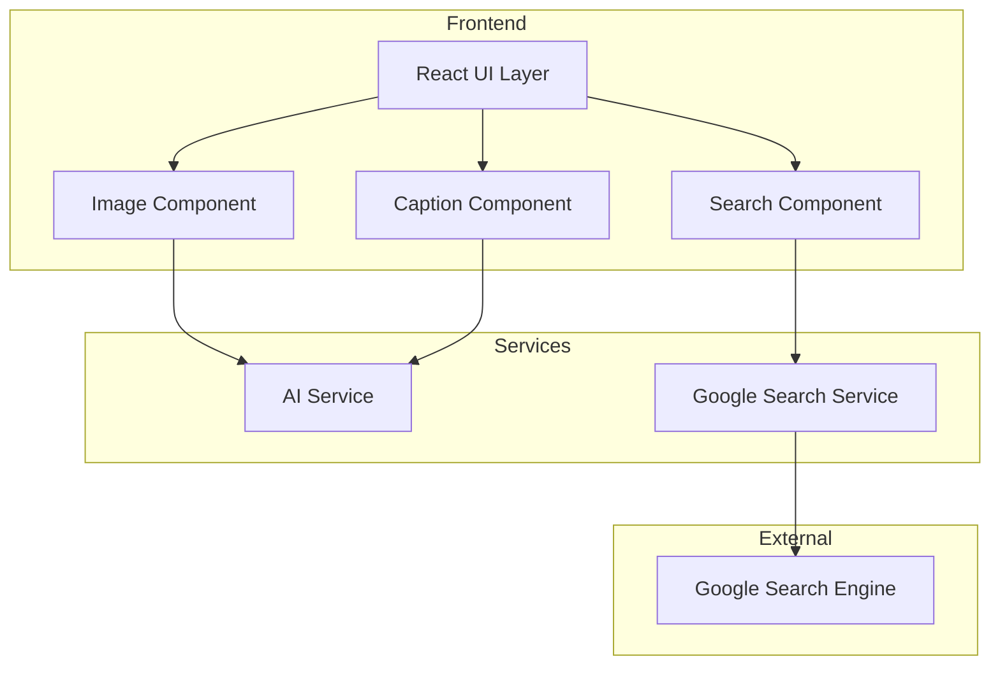
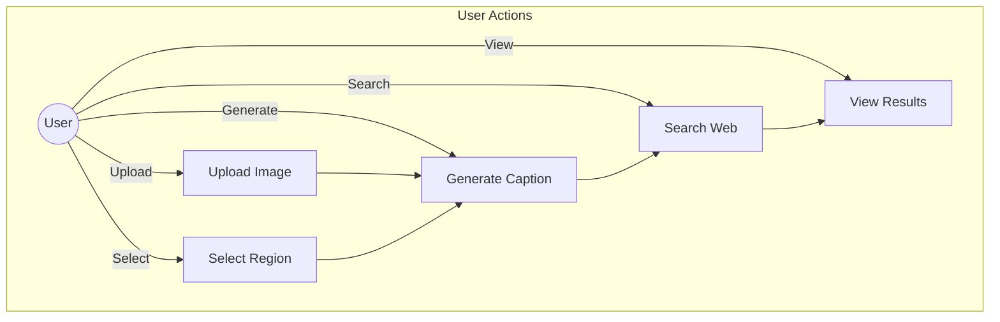
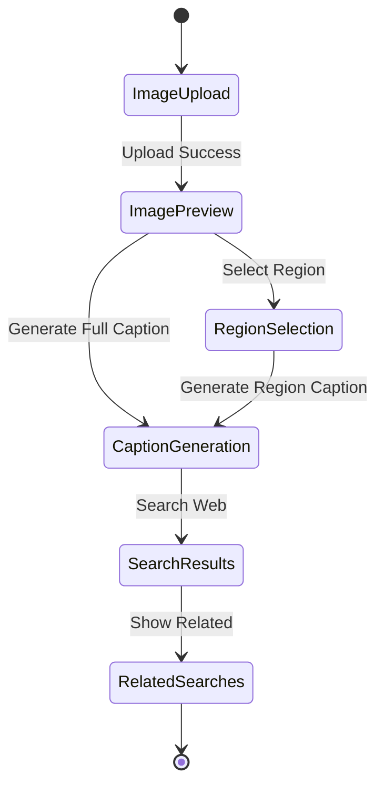
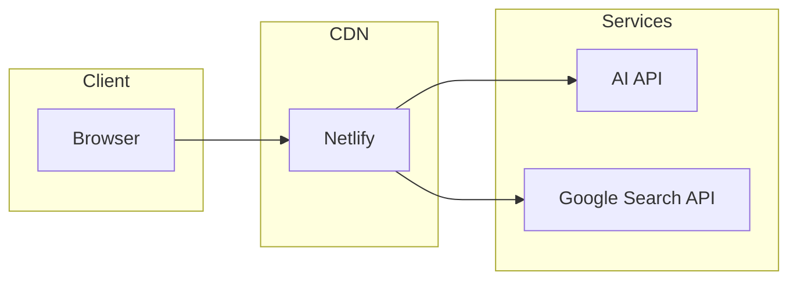

# Deep Lens System Design Document

## 1. System Overview

Deep Lens is a web-based application that combines AI-powered image analysis with web search capabilities. The system allows users to upload images, generate captions for entire images or selected regions, and perform related web searches based on the generated captions.

## 2. Architecture Diagram

## 3. Use Case Diagram

## 4. Activity Diagram

## 5. Component Architecture

### 5.1 Frontend Components
- **App.tsx**: Main application container
- **Image Upload**: Handles image file selection and preview
- **Image Cropper**: Region selection using react-image-crop
- **Caption Generator**: Manages caption generation requests
- **Search Results**: Displays web search results and related searches

### 5.2 External Services
- **AI Service**: Generates image captions (simulated)
- **Google Search**: Provides web search results and related searches

## 6. Technical Stack

- **Frontend Framework**: React with TypeScript
- **Styling**: Tailwind CSS
- **UI Components**: Custom components with Lucide icons
- **Image Processing**: react-image-crop
- **HTTP Client**: Axios
- **Build Tool**: Vite

## 7. Security Considerations

- Image upload size limitations
- Input sanitization for search queries
- API key protection for external services
- Cross-Origin Resource Sharing (CORS) configuration

## 8. Performance Optimizations

- Lazy loading of components
- Image optimization
- Debounced search requests
- Caching of search results
- Optimized re-renders using React.memo

## 9. Future Enhancements

1. Real AI integration for caption generation
2. Image analysis for object detection
3. Multiple region selection
4. Advanced search filters
5. User accounts and history
6. Sharing capabilities

## 10. Deployment Architecture

